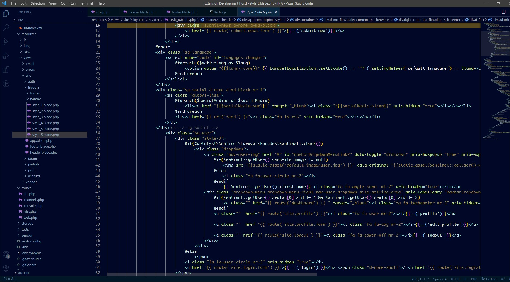

# Greative Theme

A Visual Studio Code theme for the Greative Theme out there. The Greative means Great+ Creative work. The Color choices have taken into consideration what is accessible to people with colorblindness and in low-light circumstances. Decisions were also based on meaningful contrast for reading comprehension and for optimal razzle dazzle.

## Greative Theme

# Installation

1.  Install [Visual Studio Code](https://code.visualstudio.com/)
2.  Launch Visual Studio Code
3.  Choose **Extensions** from menu
4.  Search for `Greative`
5.  Click **Install** to install it
6.  Click **Reload** to reload the Code
7.  From the menu bar click: Code > Preferences > Color Theme > **Greative**

## Misc

This is my first foray into creating a theme, so if you see something amiss, please feel free to [file an issue](https://github.com/SumanKhdka/Greative-VSCode-Theme/issues)! I'm sure there are things I missed.

Any relevant changes for each version are documented in the changelog. Please update and check the changelog before filing any issues, as they may have already been taken care of.

#Developer
[Suman Khadka](https://sumankhadka.net)

